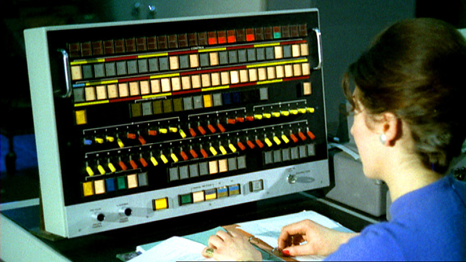



## 1. Introduktion
Ansatsen för det här dokumentet är att ge riktlinjer för att utveckla i programmeringsspråket C#. Konventionerna utgår från egna erfarenheter, Microsoft-dokumentation, StyleCop-regler samt många andra artiklar kring C#-praxis. Det förekommer punkter som inte har någon särskild motivering. Bakgrunden till dessa val är att det är bättre att bestämma en standard, och vara konsekvent, än att det blir godtyckligt.

Hur är denna artikel tänkt att fungera och användas? Vad är den och vad är den inte? Punkterna utgår oftast från en typisk webblösning med Visual Studio, C#, ASP.NET och ReSharper. Artikeln tar upp ämnen som ofta diskuteras i team eller är typiska detaljer som ofta förbises i kod. Artikeln kan också fungera som underlag när man vill sätta upp kodpraxis i team. Tänker man samma? Mest av allt är det en kom-ihåg-lista att gå igenom innan man gör kodgranskningar och migrerar ihop kod. Det är inte en komplett redogörelse för språket C#, SOLID, designmönster eller TDD. De finns andra mer djuplodade böcker och kurser för det. Den tar inte heller upp några riktlinjer för frontend-utveckling med JavaScript-ramverk, CSS etcetera.

***
### Varför kodpraxis?
Det kanske är så att vissa ser att kodningsriktlinjer begränsar kreativitet och tar för mycket tid i anspråk att följa. Men det är värt ansträngningen. Huvudskälet till att använda en konsekvent uppsättning kodningskonventioner är att standardisera struktur och kodstil så att du och andra lätt kan läsa, förstå och underhålla koden.

Fördelar med kodpraxis:
* Konventioner behövs för att öka medvetenheten om att kod i allmänhet läses tio gånger mer än den ändras.
* Konventioner behövs för att åskådligöra potentiella fallgropar för vissa konstruktioner i C#.
* Riktlinjer behövs för att göra oss bekanta med konventioner i .NET Framework, t.ex. IDisposable, LINQ-uttryck och Exceptions.
* Konventioner leder också till att minska gapet mellan erfarna och juniora utvecklare. Det är också en stor hjälp för nya teammedlemmar.
* Riktlinjer leder till minskad kostnad då underhåll av applikation går snabbare och är enklare.

***
### Bra kod
Bra kod kan kort beskrivas som:
* Enkel, men inte förenklad
* Läsbar och lätt att förstå
* Underhållningsbar
* Oberoende/frikopplad
* Effektiv
* Självdokumenterande
* Testbar

***
&#x25C0; <a href="../README.md">README</a>  |  <a href="02-Inspiration.md">Inspiration</a> &#x25B6;
