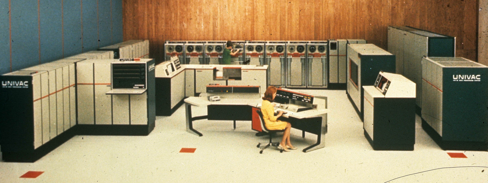

## 3. Drivande principer

Här är några generella och drivande principer vid systemutveckling.

* Håll det enkelt: försök att implementera den enklaste lösningen som motsvarar kraven.

* Överdesigna inte: med andra ord koda inte för ännu obefintliga men potentiella framtida krav.

* Optimera inte från start: prestandaproblem löses efter hand, inte när man tror att de ska uppstå. Optimering innebär ofta att läsbarheten minskar och att koden då blir svårare att förstå och underhålla.

* Ta bort kända fel innan du kodar för nya funktioner.

* Skriv minst ett enhetstest innan du åtgärdar fel.

* Refaktorera och rensa upp koden ofta.

* Läsbar kod: skriv så att en utvecklare som ser koden för första gången har lätt att förstå och kan utöka den. Tänk på formatering, storlek, namngivning, ansvarsområden, magiska strängar, upprepningar etcetera.

 
Prioritering:
1. Robusthet: koden slutar inte oväntat att fungera.
2. Korrekhet: koden gör vad den förväntas göra.
3. Prestanda: koden är tillräckligt effektiv.

***
&#x25C0; <a href="02-Inspiration.md">Inspiration</a>  |  <a href="04-Namnkonventioner.md">Namnkonventioner</a> &#x25B6;